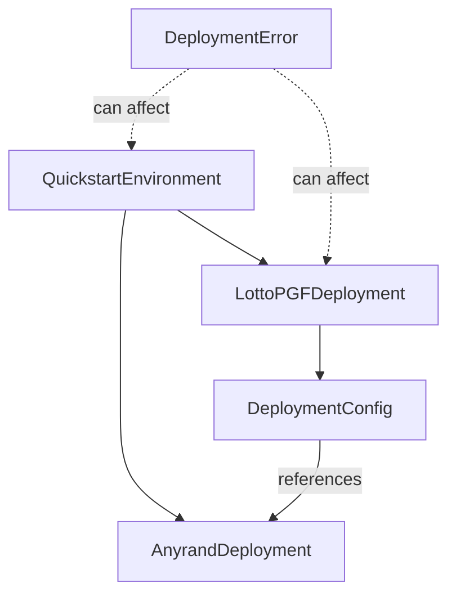

# Data Model: Deploy LottoPGF Contracts

## Core Entities

### DeploymentConfig
Represents configuration for deploying LottoPGF contracts on a specific network.

**Fields**:
- `chainId: string` - Network chain ID
- `anyrandAddress: string` - Address of deployed Anyrand contract
- `wethAddress: string` - WETH contract address for the network
- `ownerAddress?: string` - Optional owner address (defaults to deployer)
- `feeRecipient?: string` - Optional fee recipient address

**Validation Rules**:
- `anyrandAddress` must be valid Ethereum address
- `wethAddress` must be valid Ethereum address or 0x0 for local
- `chainId` must match current network

**State**: Immutable once created

---

### LottoPGFDeployment
Tracks deployed LottoPGF contract addresses.

**Fields**:
- `looteryImpl: string` - Lootery implementation contract address
- `looteryFactory: string` - LooteryFactory proxy contract address
- `ticketSVGRenderer: string` - TicketSVGRenderer contract address
- `looteryETHAdapter: string` - ETH adapter contract address
- `deploymentTimestamp: number` - Unix timestamp of deployment
- `deploymentBlock: number` - Block number of deployment
- `chainId: string` - Network chain ID

**Validation Rules**:
- All addresses must be valid and non-zero
- `deploymentBlock` must be > 0
- `deploymentTimestamp` must be valid Unix timestamp

**State Transitions**:
- Created → Verified (after address validation)
- Verified → Saved (after writing to .env)

---

### QuickstartEnvironment
Represents the complete environment after quickstart execution.

**Fields**:
- `anyrandDeployment: AnyrandDeployment` - Anyrand contract addresses
- `lottoPGFDeployment: LottoPGFDeployment` - LottoPGF contract addresses
- `consumerAddress?: string` - Optional consumer contract for testing
- `network: string` - Network name (localhost/scrollSepolia)
- `envFilePath: string` - Path to .env file with addresses

**Validation Rules**:
- Both deployments must be verified
- Network must match deployment configs
- Env file must exist and be readable

**State**: Complete when both systems deployed

---

### DeploymentError
Represents deployment failures for error handling.

**Fields**:
- `stage: string` - Stage where error occurred (anyrand/lottopgf/verification)
- `error: string` - Error message
- `context: object` - Additional error context
- `recoverable: boolean` - Whether deployment can be retried

**Validation Rules**:
- `stage` must be predefined value
- `error` must be non-empty string

---

## Relationships



## Data Flow

1. **Configuration Loading**
   - Load network-specific config from environment
   - Validate Anyrand deployment exists
   - Create DeploymentConfig entity

2. **LottoPGF Deployment**
   - Deploy contracts using DeploymentConfig
   - Create LottoPGFDeployment with addresses
   - Validate all contracts deployed correctly

3. **Environment Assembly**
   - Combine Anyrand and LottoPGF deployments
   - Create QuickstartEnvironment
   - Save to .env file

4. **Error Handling**
   - Capture DeploymentError at any stage
   - Determine if recoverable
   - Provide rollback or retry options

## Storage Schema

### Environment Variables (.env)
```
# Anyrand Contracts (existing)
ANYRAND_LOCAL_ADDRESS=0x...
BEACON_LOCAL_ADDRESS=0x...
ANYRAND_SCROLL_SEPOLIA_ADDRESS=0x...
BEACON_SCROLL_SEPOLIA_ADDRESS=0x...

# LottoPGF Contracts (new)
LOTTOPGF_FACTORY_LOCAL_ADDRESS=0x...
LOTTOPGF_IMPL_LOCAL_ADDRESS=0x...
LOTTOPGF_RENDERER_LOCAL_ADDRESS=0x...
LOTTOPGF_ADAPTER_LOCAL_ADDRESS=0x...
LOTTOPGF_FACTORY_SCROLL_SEPOLIA_ADDRESS=0x...
LOTTOPGF_IMPL_SCROLL_SEPOLIA_ADDRESS=0x...
LOTTOPGF_RENDERER_SCROLL_SEPOLIA_ADDRESS=0x...
LOTTOPGF_ADAPTER_SCROLL_SEPOLIA_ADDRESS=0x...
```

### Deployment Manifest (JSON)
Optional deployment manifest for tracking:
```json
{
  "network": "localhost",
  "timestamp": 1234567890,
  "anyrand": {
    "address": "0x...",
    "block": 123
  },
  "lottopgf": {
    "factory": "0x...",
    "implementation": "0x...",
    "renderer": "0x...",
    "adapter": "0x...",
    "block": 124
  }
}
```